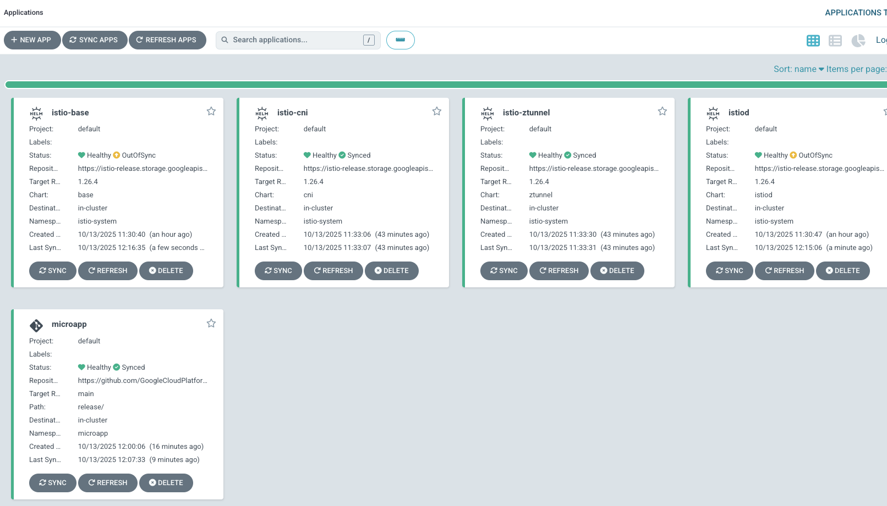

1. Install Kubernetes Gateway API CRDs
```
kubectl apply -f https://github.com/kubernetes-sigs/gateway-api/releases/download/v1.4.0/standard-install.yaml
```

2. Label the Namesapce to enroll your app into Ambient Mesh
```
kubectl label namespace microapp istio.io/dataplane-mode=ambient
```

3. Deploy your app
```
kubectl apply -f - <<EOF
apiVersion: argoproj.io/v1alpha1
kind: Application
metadata:
  name: microapp
  namespace: argocd # Or your designated Argo CD namespace
spec:
  project: default
  source:
    repoURL: https://github.com/GoogleCloudPlatform/microservices-demo.git
    targetRevision: main
    path: release/
    directory:
      include: 'kubernetes-manifests.yaml'
  destination:
    server: https://kubernetes.default.svc # Or the API server URL of your target cluster
    namespace: microapp
  syncPolicy:
    automated:
      selfHeal: true # Automatically sync differences between Git and cluster state
    syncOptions:
      - CreateNamespace=true
EOF
```

You should now see your Istio Ambient Mesh and App deployed.



If you want to see the Ui/frontend of the app, create a Gateway and HTTPRoute. This is not mandatory for the lab
```
kubectl apply --context=$CLUSTER1 -f - <<EOF
apiVersion: gateway.networking.k8s.io/v1
kind: Gateway
metadata:
  name: frontend-gateway
  namespace: microapp
spec:
  gatewayClassName: istio
  listeners:
  - name: frontend
    port: 80
    protocol: HTTP
---
apiVersion: gateway.networking.k8s.io/v1
kind: HTTPRoute
metadata:
  name: frontend
  namespace: microapp
spec:
  parentRefs:
  - name: frontend-gateway
  rules:
  - matches:
    - path:
        type: PathPrefix
        value: /
    backendRefs:
      - name: frontend
        port: 80
EOF
```